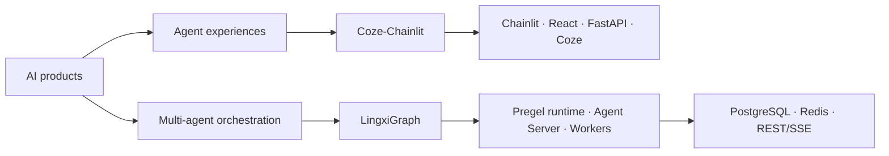

<div align="center">

# LingXi · 灵犀

### Infrastructure for durable multi-agent systems

面向生产环境的开放式 AI 基础设施，让智能体应用更可靠、更可组合、更容易交付。

[](https://github.com/LingXi-Org)
[](https://github.com/LingXi-Org/LingxiGraph)
[](https://github.com/LingXi-Org/Coze-Chainlit)
[](https://github.com/orgs/LingXi-Org/repositories)

[探索项目](https://github.com/orgs/LingXi-Org/repositories) · [LingxiGraph](https://github.com/LingXi-Org/LingxiGraph) · [Coze-Chainlit](https://github.com/LingXi-Org/Coze-Chainlit)

</div>

---

## What we build

LingXi 专注于智能体系统从“可以演示”走向“可以长期运行”的工程基础：确定性的图执行、可恢复状态、分布式任务处理、模型供应商适配，以及真正可部署的全栈 AI 体验。

| Project | What it is | Built for |
| --- | --- | --- |
| **[LingxiGraph](https://github.com/LingXi-Org/LingxiGraph)** | 模型供应商中立的持久化多智能体图运行平台，提供 Python SDK、Agent Server、分布式 Worker、checkpoint 与流式 API。 | 构建可靠的智能体编排、工作流与生产级 Agent 服务 |
| **[Coze-Chainlit](https://github.com/LingXi-Org/Coze-Chainlit)** | 基于 Chainlit、React、FastAPI 与 Coze 的全栈计算机网络学习应用，包含多学习人格、管理后台和 Docker 部署。 | 构建可交付的 AI 学习体验与 Coze 集成应用 |

## Technology map



## Engineering principles

- **Reliability before magic** — 状态、重试、恢复和幂等是运行时能力，而不是应用侧补丁。
- **Provider-neutral by design** — 模型和工具通过稳定协议接入，避免核心业务被单一供应商锁定。
- **Production is the default** — 从本地 SDK 到认证、审计、队列、可观测性与分布式部署保持一致语义。
- **Open by construction** — 公开设计、代码与问题，让基础设施在真实反馈中持续演进。

## Get started

```bash
# Durable graph runtime
pip install lingxigraph

# Full-stack learning application
git clone https://github.com/LingXi-Org/Coze-Chainlit.git
```

从 [LingxiGraph 快速开始](https://github.com/LingXi-Org/LingxiGraph#%E5%B5%8C%E5%85%A5%E5%BC%8F-sdk)了解图运行时，或查看 [Coze-Chainlit 部署指南](https://github.com/LingXi-Org/Coze-Chainlit#docker-compose-%E9%83%A8%E7%BD%B2)启动完整应用。

## Contributing

我们欢迎清晰的问题报告、设计讨论、文档改进与 Pull Request。请在对应项目中提交：

- [LingxiGraph Issues](https://github.com/LingXi-Org/LingxiGraph/issues)
- [Coze-Chainlit Issues](https://github.com/LingXi-Org/Coze-Chainlit/issues)
- [Coze-Chainlit Contribution Guide](https://github.com/LingXi-Org/Coze-Chainlit/blob/main/CONTRIBUTING.md)

<div align="center">

**Build agents that keep working after the demo ends.**

</div>
