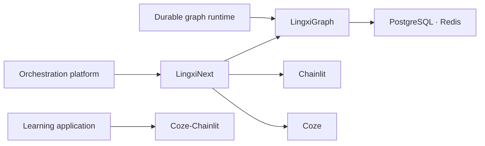

<div align="center">

# LingXi · 灵犀

### Reliable infrastructure and deployable experiences for multi-agent systems

让智能体应用从可演示走向可恢复、可审计、可持续演进的生产系统。

[](https://github.com/LingXi-Org)
[](https://github.com/LingXi-Org/LingxiGraph)
[](https://github.com/orgs/LingXi-Org/repositories)

[项目列表](https://github.com/orgs/LingXi-Org/repositories) ·
[LingxiGraph](https://github.com/LingXi-Org/LingxiGraph) ·
[LingxiNext](https://github.com/LingXi-Org/LingxiNext) ·
[贡献指南](https://github.com/LingXi-Org/.github/blob/main/CONTRIBUTING.md)

</div>

---

## Projects

| Project | Role | Use it when |
| --- | --- | --- |
| **[LingxiGraph](https://github.com/LingXi-Org/LingxiGraph)** | 供应商中立、可持久化的多智能体图运行时，提供 SDK、checkpoint、流式事件、Agent Server 与 Worker。 | 需要构建可恢复的 Agent 图、工作流或分布式运行服务 |
| **[LingxiNext](https://github.com/LingXi-Org/LingxiNext)** | 基于 LingxiGraph、原生 Chainlit、PostgreSQL 与 Coze 的版本化多智能体编排平台。 | 需要可视化管理、不可变 revision、会话固定和 Docker Compose 部署 |
| **[Coze-Chainlit](https://github.com/LingXi-Org/Coze-Chainlit)** | Chainlit、React、FastAPI 与 Coze 构建的全栈计算机网络学习应用。 | 需要参考完整学习产品、课程业务和 Coze 集成 |

## Technology map



## Engineering principles

- **Reliability before magic** — 状态、取消、重试、恢复与幂等必须是可验证的运行时能力。
- **Safe composition** — 用稳定协议和受约束模板组合 Agent，默认拒绝任意代码注入。
- **Version everything** — 锁定依赖、图 revision 与部署配置，让历史会话保持可解释。
- **Production is the default** — 认证、审计、健康检查、迁移和容器安全不是后续补丁。
- **Open by construction** — 公开设计、代码和问题，在真实反馈中持续演进。

## Get started

```bash
# Graph runtime
pip install lingxigraph

# Deployable orchestration platform
git clone --recurse-submodules https://github.com/LingXi-Org/LingxiNext.git
cd LingxiNext
cp .env.example .env
docker compose up --build
```

## Contributing and security

欢迎问题报告、设计讨论、文档改进与 Pull Request。提交前请阅读：

- [Contribution guide](https://github.com/LingXi-Org/.github/blob/main/CONTRIBUTING.md)
- [Security policy](https://github.com/LingXi-Org/.github/blob/main/SECURITY.md)
- [Support guide](https://github.com/LingXi-Org/.github/blob/main/SUPPORT.md)
- [Code of Conduct](https://github.com/LingXi-Org/.github/blob/main/CODE_OF_CONDUCT.md)

安全漏洞请勿通过公开 Issue 报告；请使用受影响仓库的 **Security → Report a vulnerability**。

<div align="center">

**Build agents that keep working after the demo ends.**

</div>
