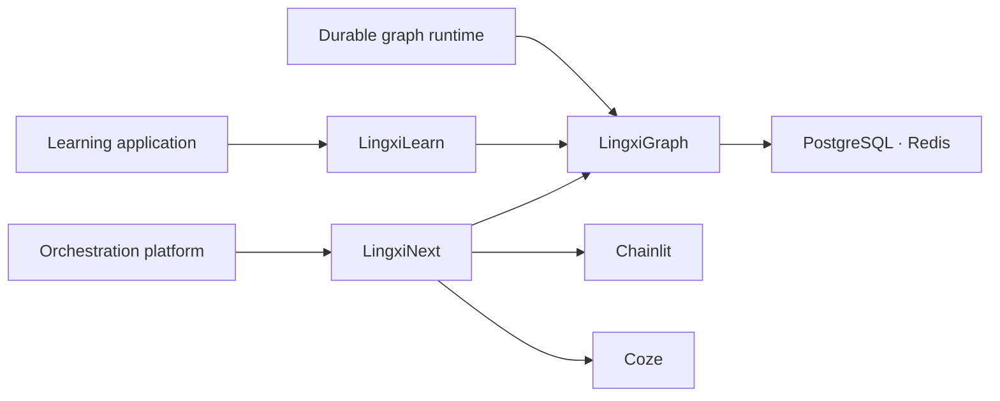

<div align="center">

# LingXi · 灵犀

### Learning experiences and reliable infrastructure for the next generation of builders

让 AI 学习从“给出答案”走向理解状态、动手实践、验证掌握，并留下可回溯的学习证据。

[](https://github.com/LingXi-Org/LingxiLearn)
[](https://github.com/LingXi-Org/LingxiLearn)
[](https://github.com/LingXi-Org/LingxiGraph)
[](https://github.com/orgs/LingXi-Org/repositories)

[进入 LingxiLearn](https://github.com/LingXi-Org/LingxiLearn) ·
[Join LingXi / 加入我们](https://github.com/LingXi-Org/.github/issues/new?template=join-lingxi.yml) ·
[项目列表](https://github.com/orgs/LingXi-Org/repositories) ·
[贡献指南](https://github.com/LingXi-Org/.github/blob/main/CONTRIBUTING.md)

</div>

---

## Featured project · LingxiLearn

**[LingxiLearn](https://github.com/LingXi-Org/LingxiLearn)** 是面向高校工科学生的 AI 学习与工程实践助教。
它不替学生做题，而是理解学习状态，调用真实工具处理真实工程工件，用启发式交互推动学生自己到达结论，再验证是否真正掌握。

计算机网络是第一个课程包，教学内核与具体学科解耦，后续可扩展数据结构、操作系统、组成原理与嵌入式等课程。

```text
理解状态 → 处理真实工件 → 启发式交互 → 验证掌握 → 留下学习证据
```

## The LingXi stack

| Project | Role | Use it when |
| --- | --- | --- |
| **[LingxiLearn](https://github.com/LingXi-Org/LingxiLearn)** | 面向高校工科学生的 AI 学习与工程实践助教；以课程包和真实工具驱动可验证学习。 | 想构建、体验或贡献下一代 AI 学习产品 |
| **[LingxiGraph](https://github.com/LingXi-Org/LingxiGraph)** | 供应商中立、可持久化的多智能体图运行时，提供 SDK、checkpoint、流式事件、Agent Server 与 Worker。 | 需要构建可恢复的 Agent 图、工作流或分布式运行服务 |
| **[LingxiNext](https://github.com/LingXi-Org/LingxiNext)** | 基于 LingxiGraph、原生 Chainlit、PostgreSQL 与 Coze 的版本化多智能体编排平台。 | 需要可视化管理、不可变 revision、会话固定和 Docker Compose 部署 |
| **[LingxiSkills](https://github.com/LingXi-Org/LingxiSkills)** | 面向 LingxiGraph 及兼容运行时的开放 Agent Skills 库。 | 需要复用或贡献标准化 Agent 能力 |

## Technology map


```mermaid
flowchart LR
    Runtime["Durable graph runtime"] --> Graph["LingxiGraph"]
    Platform["Orchestration platform"] --> Next["LingxiNext"]
    Product["Learning application"] --> Learn["LingxiLearn"]
    Learn --> Graph
    Next --> Graph
    Next --> Chainlit["Chainlit"]
    Next --> Coze["Coze"]
    Graph --> Storage["PostgreSQL · Redis"]
```

## Engineering principles

- **Reliability before magic** — 状态、取消、重试、恢复与幂等必须是可验证的运行时能力。
- **Safe composition** — 用稳定协议和受约束模板组合 Agent，默认拒绝任意代码注入。
- **Version everything** — 锁定依赖、图 revision 与部署配置，让历史会话保持可解释。
- **Production is the default** — 认证、审计、健康检查、迁移和容器安全不是后续补丁。
- **Open by construction** — 公开设计、代码和问题，在真实反馈中持续演进。

## Get started

```bash
# AI learning product
git clone https://github.com/LingXi-Org/LingxiLearn.git
cd LingxiLearn
make setup
make dev
# open http://localhost:8000
```

## Contributing and security

欢迎问题报告、设计讨论、课程内容、文档改进与 Pull Request。
想一起做产品、课程、工程或设计？选择一个方向，提交 **[Join LingXi / 加入我们](https://github.com/LingXi-Org/.github/issues/new?template=join-lingxi.yml)**，只需填写最少信息即可。

提交代码前请阅读：

- [Contribution guide](https://github.com/LingXi-Org/.github/blob/main/CONTRIBUTING.md)
- [Security policy](https://github.com/LingXi-Org/.github/blob/main/SECURITY.md)
- [Support guide](https://github.com/LingXi-Org/.github/blob/main/SUPPORT.md)
- [Code of Conduct](https://github.com/LingXi-Org/.github/blob/main/CODE_OF_CONDUCT.md)

安全漏洞请勿通过公开 Issue 报告；请使用受影响仓库的 **Security → Report a vulnerability**。

<div align="center">

**Build agents that keep working after the demo ends.**

</div>
